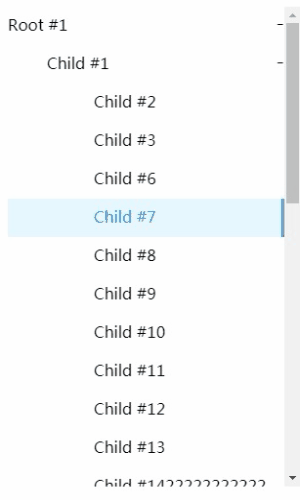
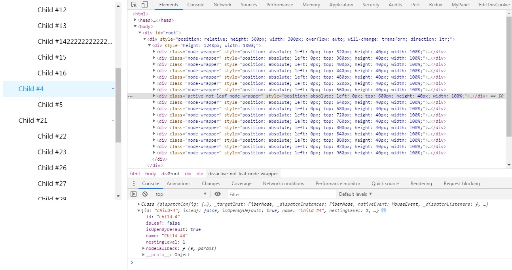

 
## react-virtualized-menu-tree

 [react-virtualized-menu-tree](https://github.com/dxmz/react-virtualized-menu-tree)  is used for rendering large tree structures. It is built on top of the [react-vtree](https://github.com/Lodin/react-vtree) library.

 Try the [demo](https://dxmz.github.io/react-virtualized-menu-tree/) first, enjoy it.

***Notice***: This library rewrites some features of `react-vtree`, such as `styles`、 `behaves`. It is lightweight and simplifies usage and beautifies looks. Especially, this library is more suited to `large-scale menu-tree scenarios`.

<div align="center">
  
</div>

# Installation
```
npm i react-virtualized-menu-tree
```

# Usage
Demo source codes are put in library path `example/src/app.js`.
```js
import React from 'react'
import { render } from 'react-dom'
import VirtualizedMenuTree from 'react-virtualized-menu-tree';
import 'react-virtualized-menu-tree/lib/css/style.css';

const tree = {
    name: 'Root #1',
    id: 'root-1',
    children: [
        {
            children: [
                {id: 'child-2', name: 'Child #2'},
                {id: 'child-3', name: 'Child #3'},
                {id: 'child-6', name: 'Child #6'},
                {id: 'child-7', name: 'Child #7'},
                {id: 'child-8', name: 'Child #8'},
                {id: 'child-9', name: 'Child #9'},
                {id: 'child-10', name: 'Child #10'},
                {id: 'child-11', name: 'Child #11'},
                {id: 'child-12', name: 'Child #12'},
                {id: 'child-13', name: 'Child #13'},
                {id: 'child-14', name: 'Child #142222222222222222'},
                {id: 'child-15', name: 'Child #15'},
                {id: 'child-16', name: 'Child #16'},
            ],
            id: 'child-1',
            name: 'Child #1',
        },
        {
            children: [{id: 'child-5', name: 'Child #5'}],
            id: 'child-4',
            name: 'Child #4',
        },
        {
            children: [
                {id: 'child-22', name: 'Child #22'},
                {id: 'child-23', name: 'Child #23'},
                {id: 'child-26', name: 'Child #26'},
                {id: 'child-27', name: 'Child #27'},
                {id: 'child-28', name: 'Child #28'},
                {id: 'child-29', name: 'Child #29'},
                {id: 'child-210', name: 'Child #210'},
                {id: 'child-211', name: 'Child #211'},
                {id: 'child-212', name: 'Child #212'},
                {id: 'child-213', name: 'Child #213'},
                {id: 'child-214', name: 'Child #214'},
                {id: 'child-215', name: 'Child #215'},
                {id: 'child-216', name: 'Child #216'},
            ],
            id: 'child-21',
            name: 'Child #21',
        },
    ],
};

const App = () => <VirtualizedMenuTree clickNodeCallback={(e,params) => {console.log(e, params)}}
                                       width={'200px'}
                                       itemSize={40}
                                       treeData={tree}/>;

render(<App />, document.getElementById('root'));
```
# API  
## 1. treeData  
Data format please referen demo source codes.  

## 2. itemSize 
Default: 30 (px)  
TreeData item size is controlled by `itemSize`, so you could set you self-defined item size.  
```
This library is based on 'FixedSizeTree' of 'react-vtree'.
```

## 3. width & height  
`width`:   
Default: 100%

`height`:    
Default: 500 (px)  
***Notice :*** height must be `number` type.  

## 4. clickNodeCallback  
Default: null  
`clickNodeCallback` will be invoked when you click any node in menu tree, and passing `event`、`node info` params to the callback function.  

## 5. toggleUpIcon & toggleDownIcon  
Default:
```js
<span className={'node-toggle-icon'}>+</span>
<span className={'node-toggle-icon'}>-</span>
``` 
You could pass self-defined `React Node` or `String` to replace them.  

## 6. isOpenByDefault  
Default: true  
Menu tree default open all children node. If you want change it, just pass `false` to close all opened children.  

## 7. treeWalker  
An iterator function that walks around the tree and yields each node one by one flattening them to an array that can be easily displayed by FixedSizeList component.  
***Notice :*** more detail please visit [react-vtree](https://www.npmjs.com/package/react-vtree).  

```
If you want pass more props please visit `react-vtree` npm website.
```
